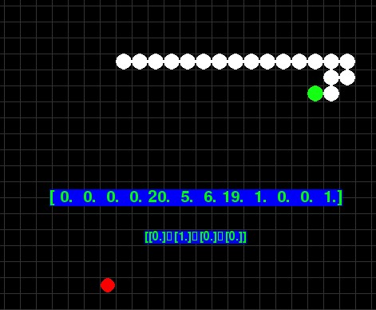

# Snake_IA

En este proyecto se presenta una inteligencia artificial entrenada para jugar el juego de computador snake. 

 == Para observar el ejemplo es necesario ejecutar el archivo "Entrenada.py" ==

En la imagen se muestra un pantallazo del juego, el circulo verde representa la cabeza de la serpiente. El circulo rojo representa la manzana o 
alimento. De manera tecnica, la serpiente es controlada por una red neuronal (totalmente conectada) cuyos pesos fueron optimizados con un algoritmo genetico. La función de fitness corresponde a:
 +10 : si la serpiente se come una manzana
 -100 : si la serpiente se come a si misma
 -50 : si la serpiente supera un limite de tiempo sin comer manzanas (se muere de hambre)

gracias por visitar este repositorio!
